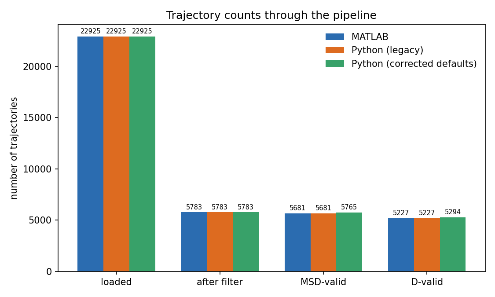
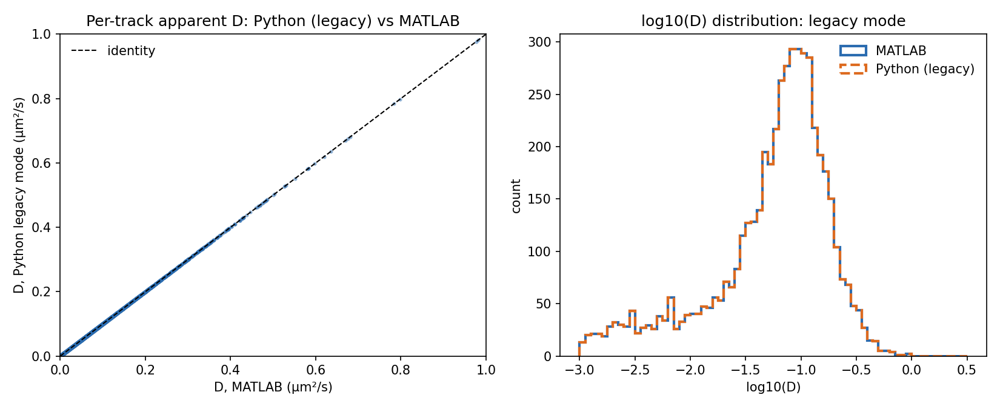
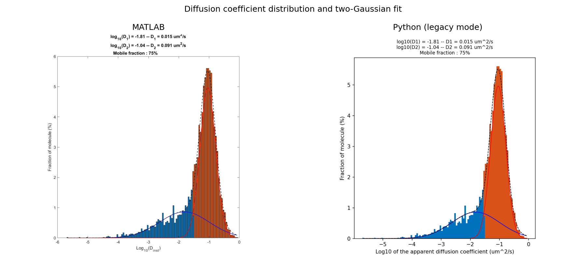
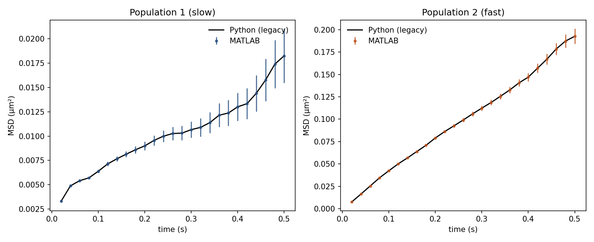
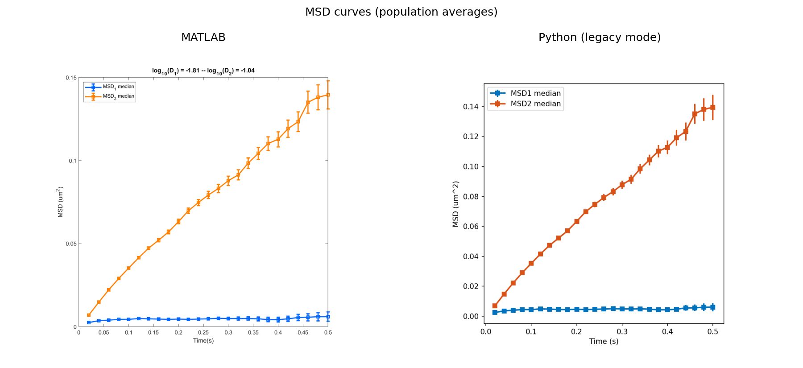
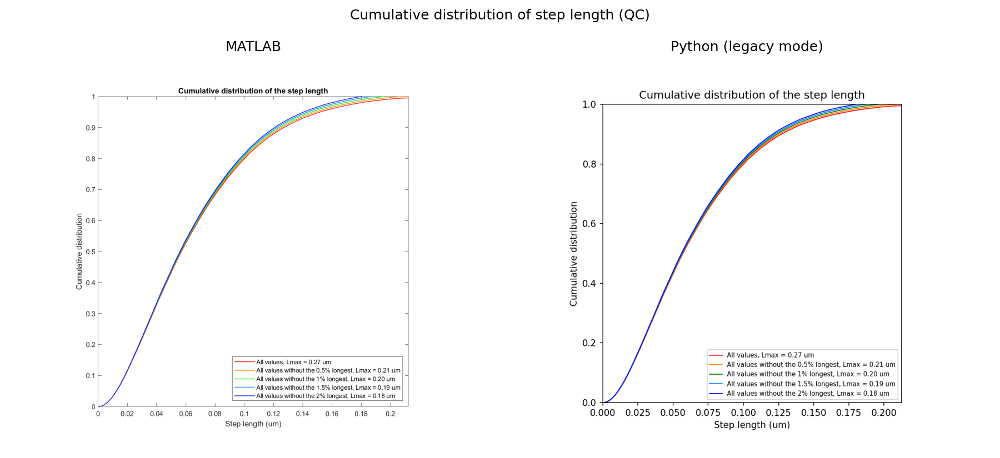
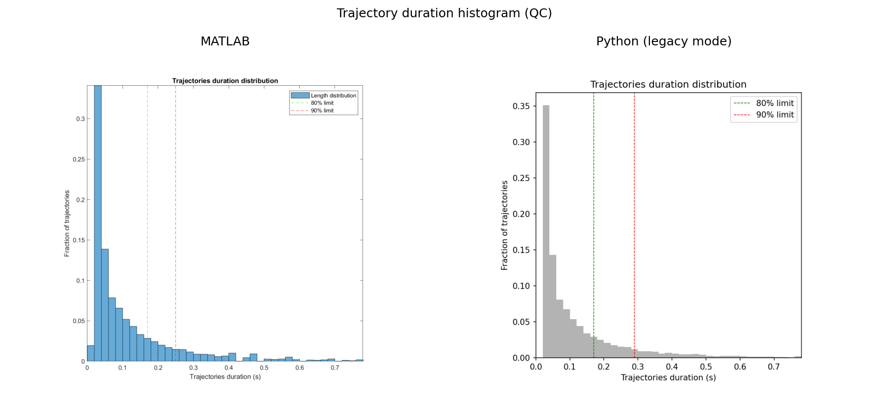
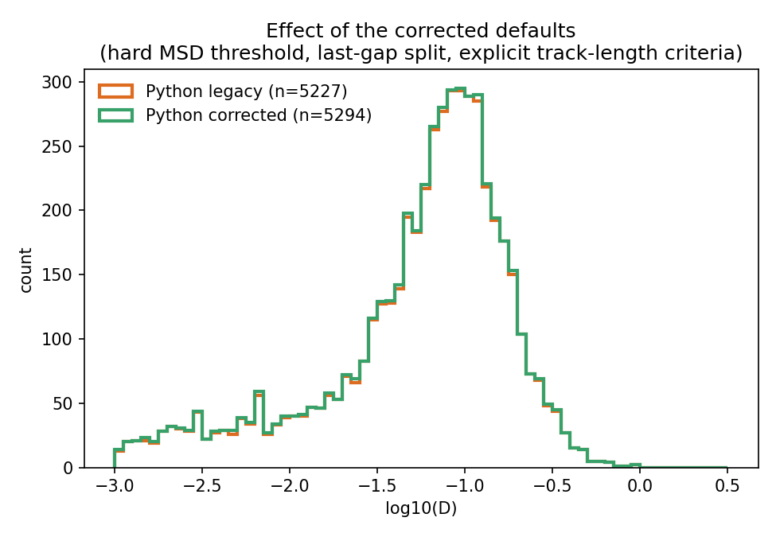

# MATLAB vs Python: validation report

Comparison of the Python package `sptpalm` against the original MATLAB
`sptPALM_viewer`, run on the same example dataset. Purpose: check that the
Python conversion reproduces the MATLAB numbers exactly in **legacy mode**,
and show the effect of the bug fixes that are on by default (see
`docs/python_conversion_plan.md`, section 3, and `docs/python_usage.md`).

## Dataset and parameters

`examples/Test_data/TrackMate_v7_batcher_results`: 10 movies (`AC0`–`AC9`),
TrackMate v7 batcher "spots" tables. Acquisition time 20 ms, pixel size
102 nm. Default parameters: `MaxBlinks` = 3, minimum track length = 7 frames
(8 detections), `MinNPointMSD` = 3, 4 MSD points for D, average method, two
Gaussians.

Three runs are compared:

- **MATLAB** — the results already saved in that folder
  (`Saved_Diffusion_Coeff.txt`, `Saved_MSD.txt`, `Parameters_analysis.txt`,
  and the PNGs), produced by `sptPALM_viewer`.
- **Python (legacy)** — `sptpalm analyze ... --legacy`, which reproduces
  every MATLAB quirk (index-based track-length test, gap-before-last-point
  glued on, strict `>` MSD threshold, non-standard Gaussian width).
- **Python (corrected defaults)** — `sptpalm analyze ...` with no flags,
  i.e. the behaviour new users get.

## 1. Trajectory counts through the pipeline

| stage | MATLAB | Python (legacy) | Python (corrected) |
|---|---:|---:|---:|
| loaded | 22925 | 22925 | 22925 |
| after filter | 5783 | 5783 | 5783 |
| MSD-valid | 5681 | 5681 | 5765 |
| D-valid | 5227 | 5227 | 5294 |

Legacy mode matches MATLAB at every stage, exactly. The corrected defaults
pass 84 more tracks at the MSD step (hard `>=` threshold instead of strict
`>`) and 67 more at the D step, for the reasons above; the gap-before-last-
point fix makes no difference on this dataset.

## 2. Apparent diffusion coefficient

| | MATLAB | Python (legacy) | Python (corrected) |
|---|---:|---:|---:|
| n tracks | 5227 | 5227 | 5294 |
| mean D (µm²/s) | 0.08688 | 0.08688 | 0.08661 |
| median D (µm²/s) | 0.07010 | 0.07010 | 0.06985 |
| mean log10(D) | -1.3492 | -1.3492 | -1.3522 |

In legacy mode the 5227 apparent D values match MATLAB's
`Saved_Diffusion_Coeff.txt` **track for track**: maximum absolute difference
1.4·10⁻¹⁴ µm²/s (maximum relative difference 3.5·10⁻¹⁰), i.e. floating-point
noise, not a methodological difference.

The native output figure (histogram + two-Gaussian fit, as written by each
version) is the same plot type in both cases:

Fit results, read directly off each version's own output:

| | MATLAB | Python (legacy) | Python (corrected) |
|---|---:|---:|---:|
| log10(D), population 1 (slow) | -1.81 | -1.814 | -1.825 |
| log10(D), population 2 (fast) | -1.04 | -1.042 | -1.043 |
| mobile (fast) fraction | 75% | 74.9% | 74.7% |
| R² of the fit | — (not printed by MATLAB) | 99.02% | 99.01% |

The two-Gaussian fit (started from an automatic threshold estimate in
Python, from a user click in MATLAB) converges to the same solution.

## 3. MSD curves

`Saved_MSD.txt` (mean, median and SEM of the MSD per population, at each of
the 25 lags up to `MaxDisplayTime` = 0.5 s) matches to floating-point
precision in legacy mode — maximum relative difference over all six columns
(MSD1/MSD2 × average/median/error bar): 7.0·10⁻¹⁴.

Native output figures:

## 4. QC plots

The cumulative step-length distribution and the trajectory-duration
histogram (not part of the numerical comparison above, but plotted from the
same tracks) agree visually between the two versions:

The 90% duration marker sits slightly further right in the Python plot
(≈0.29 s vs ≈0.25 s in MATLAB); this is a cosmetic difference in how that
guide line is computed from track duration and does not affect any analysis
result above.

## 5. Effect of the corrected defaults

Not a MATLAB-vs-Python check, but shown for context: the corrected defaults
(hard MSD threshold, gap-before-last-point split, explicit track-length
criteria) let a few more short/borderline tracks through, with essentially
no effect on the resulting distribution:

## Conclusion

Run in legacy mode, the Python package reproduces the MATLAB
`sptPALM_viewer` output for this dataset at every stage checked here: track
counts, all 5227 apparent diffusion coefficients (to ~1e-14), the MSD curves
of both populations (to ~1e-13), and the two-Gaussian fit. This is also
covered by the automated tests in `tests/test_reference.py`
(`test_track_counts_and_diffusion_coefficients_match_matlab`,
`test_population_msd_matches_matlab`), which run this same comparison on
every change to the code. With the corrected defaults, the differences from
MATLAB are limited to the documented, deliberate bug fixes and stay within a
couple of percent of the track counts.

*Generated 2026-09-22 from `examples/Test_data/TrackMate_v7_batcher_results`.
Regenerate with `sptpalm analyze ... --legacy` and `sptpalm analyze ...`
(see `docs/python_usage.md`) if the example dataset or the code changes.*
